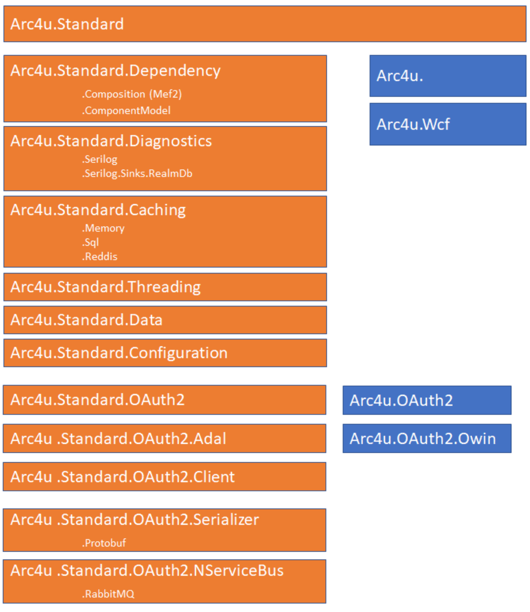

# Arc4u

Arc4u is originaly based on architecture for you.
The target of this framework is to provide a frmework where most of the common features needed by an application is covered.

The new version 3.1.0.0 is a migration from the .Net one but completely revisited to use the latest feature of .Net Core 3.1.

The features are:
- The caching.
- The Logging.
- The serialization used by the caching.
- OAuth2 and OpenId connect (AzureAD and ADFS)
- The Dependency injection.

The framework is designed to be flexible enough so the application is using an "API" and the implementation can be changed.
For example, the Dependency injection encapsulates the functionality of the container and you can change the container if you want.
Two implementations exist:
- Arc4u.Dependency.Composition (used eagerly by .Net, Mef2).
- Arc4u.Dependency.ComponentModel (used by .Net core 3.1).

Those can be instantiated but the code doesn't know the container used.

The same philosophy is used for the logging, the serialization and OAuth2 (where differents token provider can be used).

## The framework.

The way the framework is built is always based with 2 aspects in mind:
- abstraction
- and injection.

Abstraction allows a developer to work with a concept with no affinity with a particular concept. 
Injection means that the framework resolve implementation based on interfaces so you can change the behaviour as much as possible.

## Dependency

