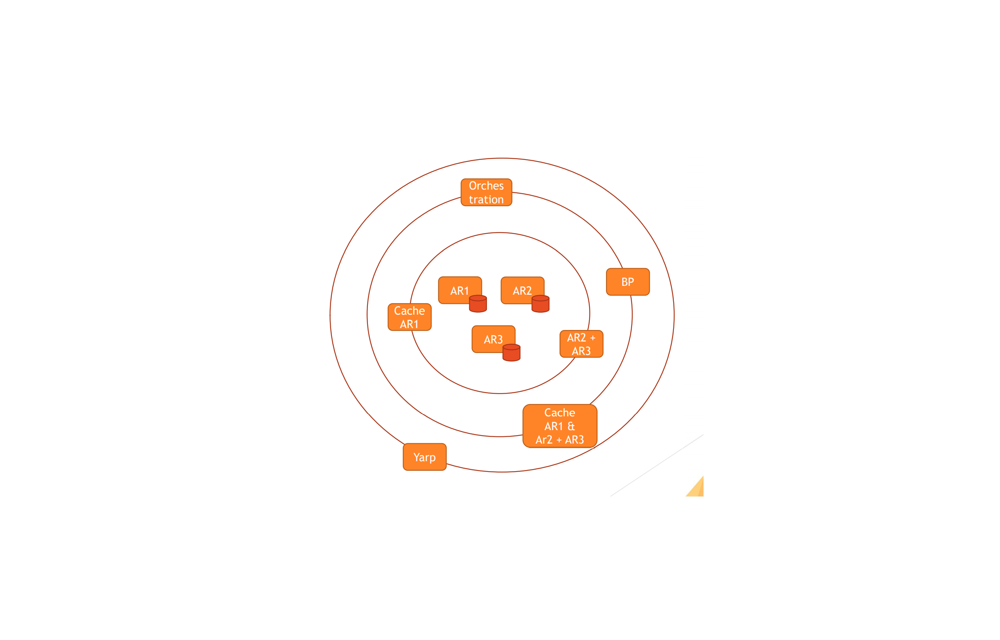
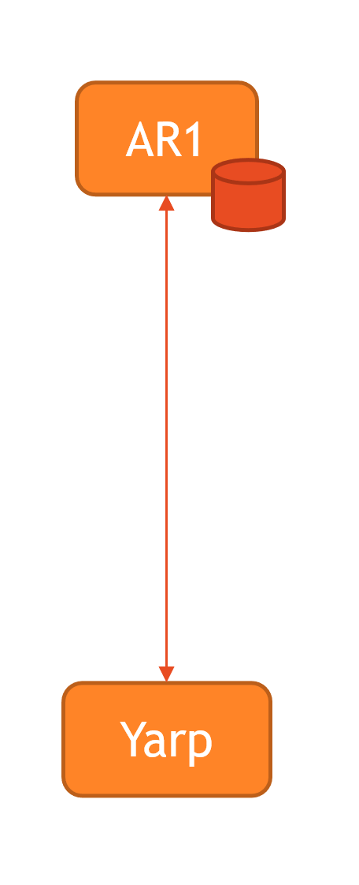
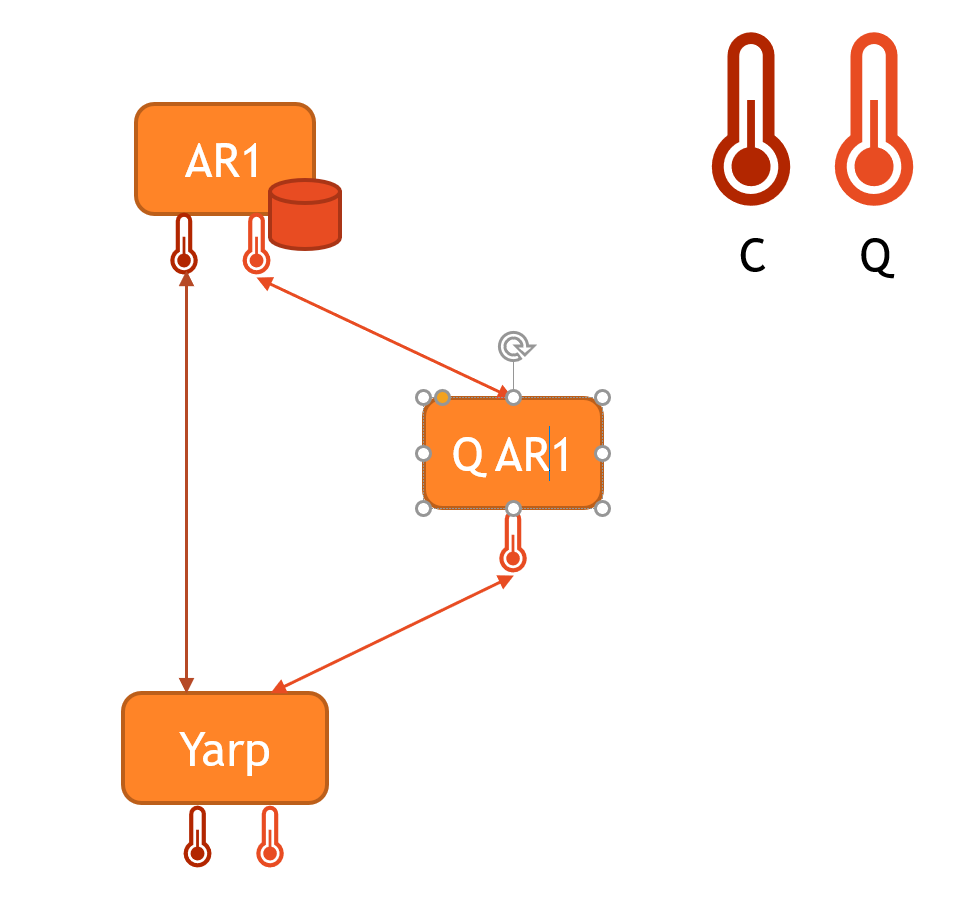

# Yarp
#### November 2020
During my micro-services architecture journey it was clear that it was important to have a reverse proxy.
This will help me to compose and unify from a gateway the requests to my services but also implement a CQRS pattern
in an lean way.

Remark:
On a micro-services architecture you have 2 main communication pattern:
- Synchronous : Rest Api or gRpc
- Asynchronous: via message broker (Bus).

As here I am spoken about Yarp, I only focuse on the synchronous communication part of the microservices.

#### What is a micro-service.

Source from: https://microservices.io/

"Microservices - also known as the microservice architecture - is an architectural style that structures an application as a collection of services that are

- Highly maintainable and testable
- Loosely coupled
- Independently deployable
- Organized around business capabilities
- Owned by a small team

The microservice architecture enables the rapid, frequent and reliable delivery of large, complex applications. 
It also enables an organization to evolve its technology stack."

For me a micro-service is a generic service able to ingest and restitute data. It can transform data, enrich data
do orchestration based on the data, etc...

To decrease the complexity of an application and increase the functionalities, we add them into microservices in an ognion layers. 
At the center of the ognion we will have the services manipulating the aggregate root objects
of your application and the other layers will be composition and or cache services.

At the top level layer, we will find orchestration and or business process services and finally the Reverse proxy one
which will root all the gRpc or Http requests to the good services.
 
##### Agregate root microservice
This kind of service will implement the basic functionalities and business rules arround the agregate root probably in 
a CRUD way allowing to manipulate its entity. The service will be concentrated to serve the data in a secure and
quick way giving performance to access the data. There is always a storage associate to this kind of services.

The service will be able to be accessed from API but will be also connected to a BUS to send events and commands.
In both cases we don't put the full paylod of the messages (but for very tiny and stable entities like a measure)
to be sure that:
- we don't have to change immediately all the consumers listening on the BUS if the message change (by changing the aggregate root).
- we don't increase the bandwith with unused payload (often the Command or Event name provides enough information to the consumer).
- we avoid data duplication (referential data are simply queried when needed via the API).

##### Composition services
The purpose of this service is to provide a new object with enrich data by combining differents aggregate roots (Company & Contracts by exemle).

##### Cache services.
This kind of service will add a cache layer to speed the result of request and dwindle the pressure on the storage system.
In real application, the business need is always to have the capability to query and return the set of data based on criteria.
In any case the GetByID and List of are 2 important needs and must be addressed in a efficient way.
What is important to thing its the cost of a caching solution.

If the amount of data requested on your aggreagate root service is low enough that the pressure and speed are
sufficiently acceptable for your business need, there is no reason to add this extra cache layer.

##### CQRS via your reverse proxy (yarp).
The beautifull aspect when you can intoduce a reverse proxy in your architecture is the capability to start in
by being concentrated to the need of the business => You don't have to immediately think about CQRS and if you will
add your caching layer immediately.

You simply implement your business.

{:height="100" width="100px"}

From your configuration file you inform the backend you want to reach like this:
In this exemple, the aggregate root service AR1 is implementing an ArsController.

````json
{
  "ReverseProxy": {
    "Routes": [
      {
        "RouteId": "ar1/ars",
        "ClusterId": "ar1",
        "AuthorizationPolicy": "Default",
        "Match": {
          "Path": "/api/ars/{*remainder}"
        },
        "Transforms": [
          { "PathPattern": "/api/ars/{*remainder}" }
        ]
    ],
    "Clusters": {
      "ar1": {
        "Destinations": {
          "ar1/destination1": {
            "Address": "http://ar1/"
          }
        }
      }
    }
  }
}
````
We simply here define that all requests for the api/ars will be redirect to the http://ar1/api/ars service.

And that for all the HTTP methods: [GET, POST, PATCH, DELETE, etc...]

Now imagine that we need to add a caching concept and split the command route from the query one.
{:height="400" width="200px"}


