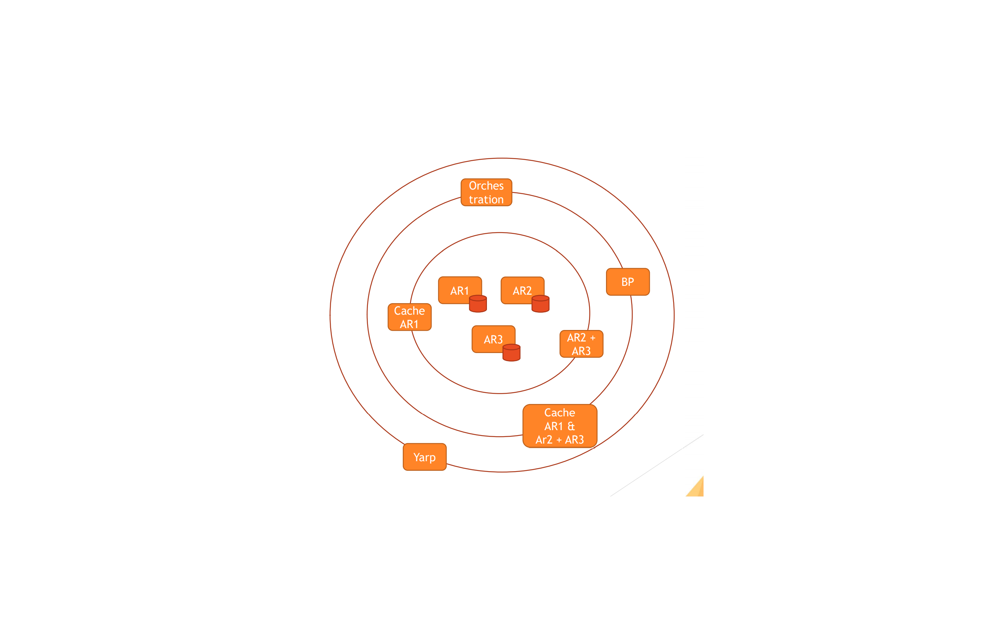

# Yarp
#### November 2020
During my micro-services architecture journey it was clear that it was important to have a reverse proxy.
This will help me to compose and unify from a gateway the requests to my services but also implement a CQRS pattern
in an lean way.

Remark:
On a micro-services architecture you have 2 main communication pattern:
- Synchronous : Rest Api or gRpc
- Asynchronous: via message broker (Bus).

As here I am spoken about Yarp, I only focuse on the synchronous communication part of the microservices.

#### What is a micro-service.

Source from: https://microservices.io/

"Microservices - also known as the microservice architecture - is an architectural style that structures an application as a collection of services that are

- Highly maintainable and testable
- Loosely coupled
- Independently deployable
- Organized around business capabilities
- Owned by a small team

The microservice architecture enables the rapid, frequent and reliable delivery of large, complex applications. 
It also enables an organization to evolve its technology stack."

For me a micro-service is a generic service able to ingest and restitute data. It can transform data, enrich data
do orchestration based on the data, etc...

To decrease the complexity of an application and increase the functionalities, we do not add them all in a micro-services
but we add them in a ognion. At the center of the ognion we will have the services manipulating the aggregate root objects
of your application and the other layers will be composition and or cache services.

At the top level layer, we will find orchestration and or business process services and finally the Reverse proxy one
which will root all the gRpc or Http requests to the good services.

 

This is probably the 

But first we will start with the following exemple.

